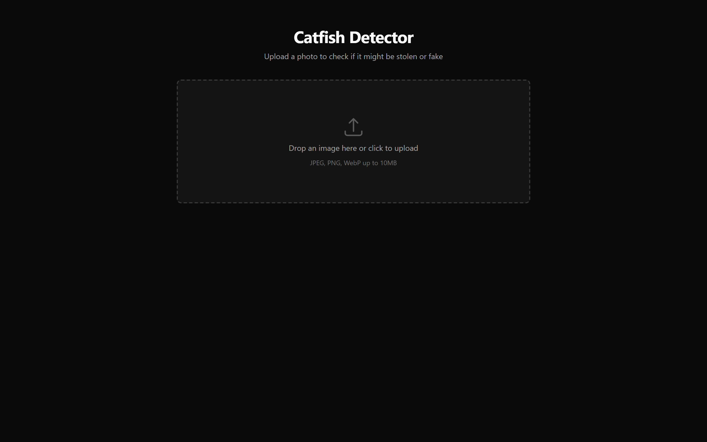
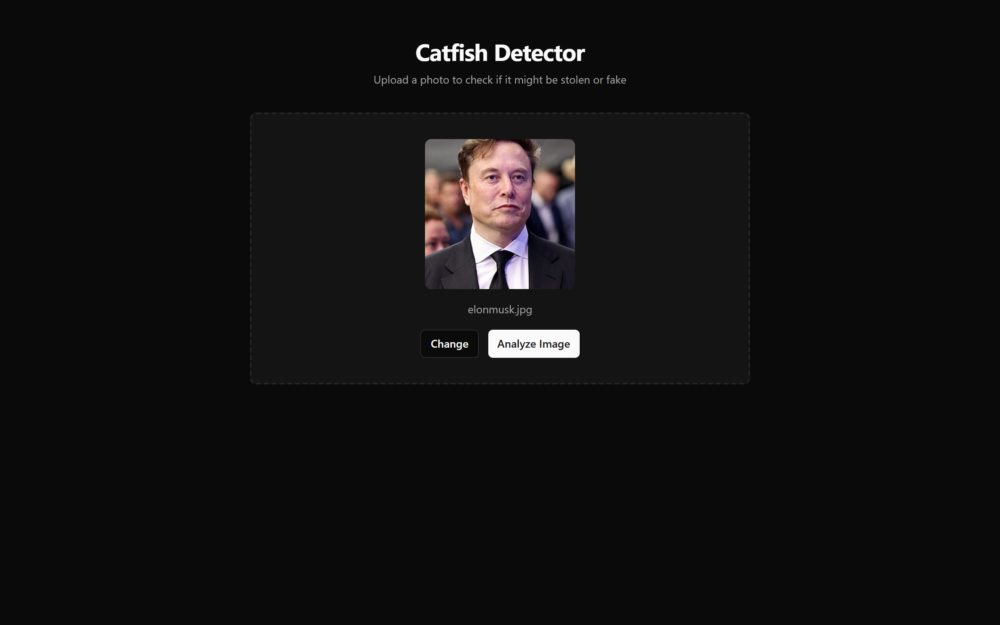
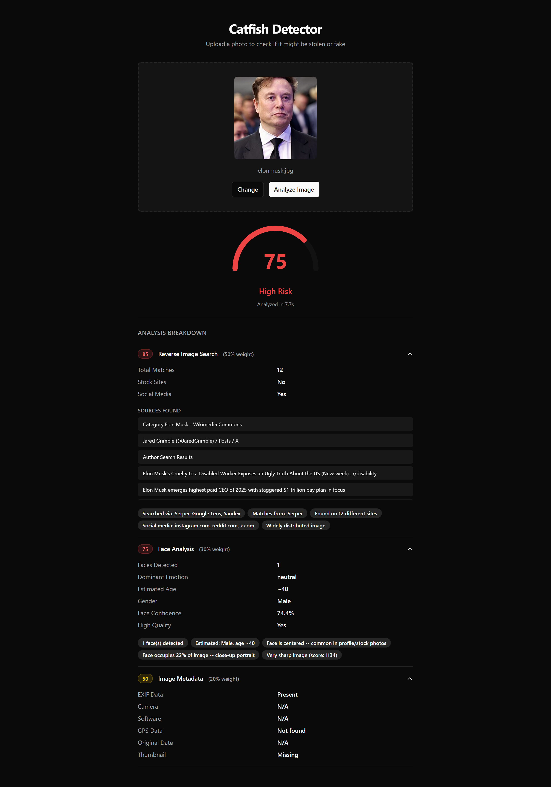

<div align="center">

<pre>
██████╗ █████╗ ████████╗███████╗██╗███████╗██╗  ██╗
██╔════╝██╔══██╗╚══██╔══╝██╔════╝██║██╔════╝██║  ██║
██║     ███████║   ██║   █████╗  ██║███████╗███████║
██║     ██╔══██║   ██║   ██╔══╝  ██║╚════██║██╔══██║
╚██████╗██║  ██║   ██║   ██║     ██║███████║██║  ██║
 ╚═════╝╚═╝  ╚═╝   ╚═╝   ╚═╝     ╚═╝╚══════╝╚═╝  ╚═╝
                D E T E C T O R
</pre>

**Upload a photo. Get the truth.**

Reverse image search + AI face analysis + metadata forensics — combined into a single risk score.

[Features](#features) · [Demo](#demo) · [How It Works](#how-it-works) · [Setup](#setup) · [Tech Stack](#tech-stack)

</div>

---

## Demo

<div align="center">

### Drop Zone


<br/>

### Image Selected


<br/>

### Analysis Result — 75/100 High Risk


> Photo found on **12 different sites** including Wikimedia Commons, X, Reddit, and Instagram.
> Face analysis detected a **centered male face, age ~40**, with professional-quality sharpness.
> EXIF metadata present but missing camera and software info.

</div>

---

## Features

- **Reverse Image Search** — Searches Google Lens, Yandex, and SerpAPI simultaneously to find where a photo has been used online. Filters out shopping sites to only surface real matches.
- **AI Face Analysis** — Detects faces using OpenCV, estimates age/gender/emotion via DNN models, and flags professional photo indicators (studio lighting, high symmetry, centered composition).
- **Metadata Forensics** — Extracts EXIF data to detect stripped metadata, editing software traces, missing camera info, and GPS coordinates.
- **Weighted Risk Score** — Combines all three signals (50% reverse image, 30% face, 20% metadata) into a 0-100 catfish probability score with a clear verdict.
- **Dark Mode Dashboard** — Minimalist UI with drag-and-drop upload, animated score gauge, and expandable analysis breakdown.

## How It Works

```
                    ┌─────────────────┐
                    │   Upload Photo  │
                    └────────┬────────┘
                             │
              ┌──────────────┼──────────────┐
              ▼              ▼              ▼
     ┌────────────┐  ┌────────────┐  ┌────────────┐
     │  Reverse   │  │    Face    │  │  Metadata  │
     │   Image    │  │  Analysis  │  │  Forensics │
     │   Search   │  │            │  │            │
     │            │  │  Age       │  │  EXIF      │
     │  Serper    │  │  Gender    │  │  Camera    │
     │  Yandex    │  │  Emotion   │  │  Software  │
     │  G. Lens   │  │  Quality   │  │  GPS       │
     └─────┬──────┘  └─────┬──────┘  └─────┬──────┘
           │   50%         │   30%         │   20%
           └──────────────┬┼───────────────┘
                          ▼
                 ┌─────────────────┐
                 │   Risk Score    │
                 │    0 — 100      │
                 └─────────────────┘
```

### Scoring

| Score | Verdict | Meaning |
|-------|---------|---------|
| 0–30 | **Likely Safe** | Photo appears authentic |
| 30–65 | **Suspicious** | Some red flags detected |
| 65–100 | **High Risk** | Strong indicators of a fake profile photo |

### What raises the score

| Signal | Impact |
|--------|--------|
| Found on stock photo sites | +40 |
| Image widely distributed (5+ sites) | +25 |
| Found on social media profiles | +10 |
| EXIF metadata completely stripped | +30 |
| Editing software detected | +20 |
| Overly happy expression (stock pose) | +15 |
| Studio lighting / high symmetry | +10 |
| Single centered face (profile photo) | +10 |

## Setup

### Prerequisites

- Python 3.11+
- Node.js 18+
- [Serper.dev API key](https://serper.dev) (free — 2,500 searches/month)

### Backend

```bash
cd backend

# Install dependencies
pip install -r requirements.txt

# Download face analysis models (~120 MB)
python download_models.py

# Configure API key
cp .env.example .env
# Edit .env and add your Serper API key

# Start server
uvicorn main:app --reload --port 8000
```

### Frontend

```bash
cd frontend

# Install dependencies
npm install

# Start dev server
npm run dev
```

Open [http://localhost:3000](http://localhost:3000) and upload a photo.

## Tech Stack

**Frontend**
- Next.js 14 (App Router)
- Tailwind CSS + shadcn/ui
- TypeScript

**Backend**
- FastAPI + Uvicorn
- OpenCV (face detection + DNN age/gender/emotion models)
- Pillow + exifread (metadata extraction)
- Serper.dev API (Google Lens reverse image search)
- Yandex + Google Lens scraping (fallback)

**Models**
- Age estimation — Caffe DNN (Gil Levi, 2015)
- Gender classification — Caffe DNN (Gil Levi, 2015)
- Emotion recognition — FERPlus ONNX (Microsoft, 2019)
- Face detection — OpenCV Haar Cascade

## Project Structure

```
catfish-detector/
├── backend/
│   ├── main.py                 # FastAPI app + CORS
│   ├── config.py               # Environment settings
│   ├── download_models.py      # Model downloader script
│   ├── models/
│   │   ├── response.py         # Pydantic response schemas
│   │   └── cv_models/          # DNN weights (downloaded via script)
│   ├── services/
│   │   ├── analyzer.py         # Orchestrator (parallel analysis)
│   │   ├── reverse_image.py    # Multi-engine reverse search
│   │   ├── face_analysis.py    # OpenCV + DNN face analysis
│   │   ├── metadata.py         # EXIF extraction
│   │   └── scoring.py          # Weighted score computation
│   ├── routers/
│   │   └── analyze.py          # POST /api/analyze endpoint
│   └── utils/
│       └── image.py            # Validation + resize
│
└── frontend/
    └── src/
        ├── app/page.tsx        # Main dashboard
        ├── components/
        │   ├── image-dropzone.tsx
        │   ├── catfish-gauge.tsx
        │   ├── score-breakdown.tsx
        │   ├── face-analysis-panel.tsx
        │   ├── metadata-panel.tsx
        │   └── reverse-image-panel.tsx
        ├── lib/api.ts          # Backend client
        └── types/analysis.ts   # TypeScript types
```

## License

MIT
